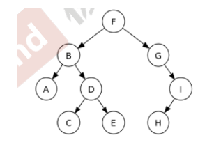

#二叉树简介及先序、中序、后序

------

大纲：  

1. 二叉树介绍
2. 先序/中序/后序 Preorder/inorder/postorder
3. 分治算法 Divide & Conquer
4. 二叉树的宽度优先遍历
5. 二叉树搜索树

##翻转二叉树

Homebrew作者Mark Howell面试被Google拒，因为不会翻转二叉树

（额……这也真够惨的……）


[原题地址](https://leetcode.com/problems/invert-binary-tree/)

解题思路：堆二叉树左右链表进行转换，是否有似曾相识的感觉？交换两个值的swap你一定写过吧，对的，就是它，我们将二叉树的左右假想为两个“特殊的值”，然后定义一个tmp用来储存一方交换值，然后交换他们即可，这里提到的“特殊的值”便是递归调用。  

示例代码：

```c++

/**
 * Definition for a binary tree node.
 * struct TreeNode {
 *     int val;
 *     TreeNode *left;
 *     TreeNode *right;
 *     TreeNode(int x) : val(x), left(NULL), right(NULL) {}
 * };
 */

class Solution {
public:
	TreeNode* invertTree(TreeNode* root) {
		if (root == NULL)
			return NULL;

		TreeNode* tmpNode = root->left;
		root->left = invertTree(root->right);
		root->right = invertTree(tmpNode);

		return root;
	}	
}


```

##二叉树



------